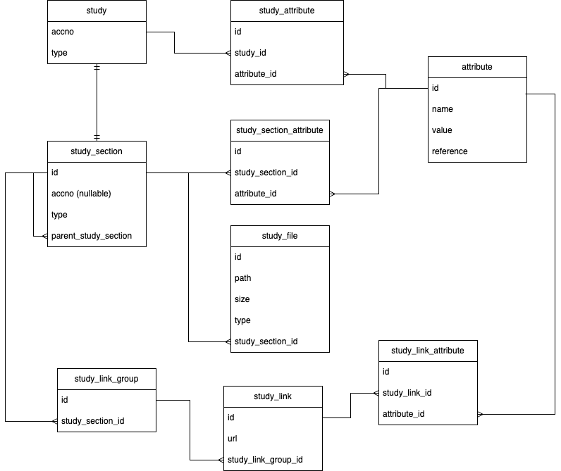

# 🧬 BioStudies Demo: A Simplified BioStudies-like System

**BioStudies Demo** is a prototype project designed to explore and replicate the core structure and functionality of studies hosted in the [BioStudies](https://www.ebi.ac.uk/biostudies/) platform.

This demo is composed of two main components:

## 🔧 Backend
A REST API built with **Spring Boot**, integrated with **PostgreSQL** and **Apache Lucene** for indexing and search capabilities.

Key features:
- Fetches real study data from the BioStudies API.
- Stores the data in a PostgreSQL database.
- Indexes the data using Apache Lucene for fast text-based search.
- Exposes endpoints to query studies by text and retrieve study details.

## 💻 Frontend
A web interface built with **Vue.js** and styled using **Tailwind CSS**.

Available pages:
- **Search**: A text-based search interface to find relevant studies.
- **Results**: Displays a list of matched studies.
- **Study Details**: Shows metadata and details of a selected study.
- **About**: A simple informational page about the project.

## 🧩 Architecture Overview

### Database Schema
The following schema was designed based on a small sample of real BioStudies data.
It aims to capture the core structure of study-related information but may not fully represent the complete complexity of the BioStudies data model.



---

## 🚀 Getting Started with Docker Compose

### ✅ Prerequisites

- [Docker](https://www.docker.com/)
- [Docker Compose](https://docs.docker.com/compose/)

---

### 🏁 Running the App

From the project root (`biostudies-demo/`), start everything with:

```bash
docker-compose up --build
```

This will:

- Build the Vue frontend and Spring Boot backend
- Set up a PostgreSQL database
- Serve everything through nginx at `http://localhost`

---

### 🌍 Access Points

| Service        | URL                                                                 |
|----------------|----------------------------------------------------------------------|
| 🧑‍💻 Frontend     | [http://localhost/](http://localhost/)                                  |
| 📡 API          | [http://localhost/api](http://localhost/api)                            |
| 📚 Swagger UI   | [http://localhost/api/swagger-ui/index.html](http://localhost/api/swagger-ui/index.html) |
| 🐘 PostgreSQL    | Host: `localhost`, Port: `5432`<br>User: `user`, Password: `password`     |

> 🔎 The API is available under `/api`. Swagger UI provides interactive documentation.

---

### 💾 Persistent Data

| Volume Name     | Purpose                          |
|------------------|----------------------------------|
| `pgdata`         | PostgreSQL database storage      |
| `lucene-index`   | Lucene index used by the backend |

These volumes persist across container rebuilds and restarts.

---

### 🔄 Common Docker Commands

Rebuild and restart everything:

```bash
docker-compose up --build
```

Rebuild only a specific service (e.g. frontend):

```bash
docker-compose build frontend
```

Stop and clean up all containers, networks, and volumes (except persistent data):

```bash
docker-compose down
```

---

### 🧰 Project Structure

```
biostudies-demo/
├── api/           # Spring Boot app
├── frontend/      # Vue.js app
├── nginx/         # nginx config
├── docker-compose.yml
└── README.md
```

---

## 📦 Tech Stack

- 🖼️ Vue.js + Tailwind CSS frontend
- 🧠 Spring Boot REST API (with Apache Lucene indexing)
- 🐘 PostgreSQL database
- 🌐 nginx reverse proxy for clean, unified access

---
## 📝 License
This project is for educational and demo purposes.